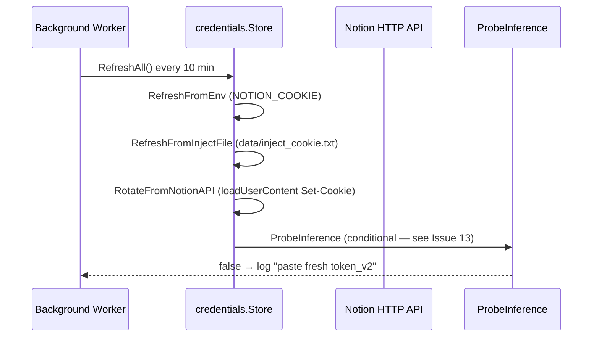
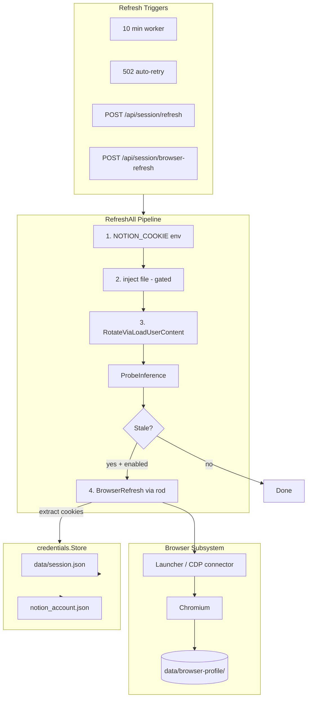
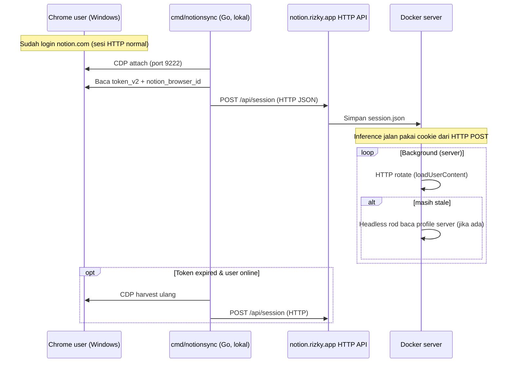

# Design: Go Headless Browser Credential Fallback & Python Legacy Removal

| Field | Value |
|-------|-------|
| **Author** | Systems Design (plan phase) |
| **Date** | 2026-06-27 |
| **Revision** | 2 — addresses design review (21 issues) |
| **Status** | Proposed — awaiting review before implementation |
| **Repo** | `Notion-AI-to-OpenAI-Compatible` |
| **Production** | `https://notion.rizky.app` (Docker Alpine → Debian+Chromium, port 8787) |
| **Workspace** | `38298ed3-0d46-8144-a1eb-00033da67864` |

---

## Overview

Replace rejected manual credential injection UX (bookmarklet, copy-paste `token_v2`, inject file) with a **Go-native headless browser fallback** that recovers `token_v2` and `notion_browser_id` from a **persistent Chromium user profile** when the existing HTTP refresh chain fails. Remove the duplicate Python implementation (`notionchat/*.py`, 14 files) and align docs/scripts with the Go-first server (`cmd/notionchat`, `internal/*`).

The bookmarklet failure (`token_v2 tidak ditemukan`) is **expected**: `notion.rizky.app` cannot read `notion.com` / `app.notion.com` cookies due to the **same-origin policy**. No client-side workaround on the proxy origin fixes this; credential harvest must run in a browser context that shares Notion's cookie domain.

---

## Background & Motivation

### Current credential pipeline



**Source files:**
- Chain: `internal/credentials/refresh.go` — `RefreshAll()` runs env → inject file → `RotateViaLoadUserContent`
- Worker: `internal/credentials/worker.go` — 10-minute ticker (`NOTION_REFRESH_INTERVAL_SEC`, default 600)
- HTTP rotate: `internal/sessionrefresh/refresh.go` — `RotateViaLoadUserContent`, `ProbeInference`, `IsStaleInferenceLine` (`[` = expired)
- Auto-retry: `internal/api/refresh.go` — on 502 stale session, calls `RefreshAll()` once
- Storage: `internal/credentials/store.go` — `data/session.json`, `notion_account.json`
- Manual UX (rejected): `internal/webui/webui.go` — bookmarklet, paste forms, `/api/session/inject`

### Why HTTP-only refresh is insufficient

| Observation | Implication |
|-------------|-------------|
| HAR shows no cookies in exported requests; inference uses workflows surface | Cookie rotation is opaque; `loadUserContent` Set-Cookie may not fire when session is fully dead |
| `ProbeInference` returns empty when stream is `[` | Token is stale beyond HTTP self-heal |
| `RotateViaLoadUserContent` returns `changed=true` without new `token_v2` (non-token Set-Cookie) | **`changed` is not a health signal** — must probe after HTTP steps |
| `RotateViaLoadUserContent` returns `changed=false` on non-200 or unchanged token | No recovery path when refresh endpoint rejects expired cookie |
| Bookmarklet reads `document.cookie` on Notion origin only | Useless when user interacts with `notion.rizky.app` |

### User requirements (hard)

1. **Golang only** for browser automation — no Python/Puppeteer sidecar
2. **Persistent browser profile** — login survives process/container restarts
3. **Docker/Linux production** — remote server deployed via `scripts/deploy.ps1` → plink → `docker compose`
4. **Integrate as last-resort** in `RefreshAll()` — not a parallel ad-hoc system
5. **No routine manual cookie copy** — one-time setup acceptable
6. **Remove** bookmarklet / manual inject from primary Web UI
7. **Delete** `notionchat/*.py` when Go path is complete

---

## Goals

| # | Goal | Success metric |
|---|------|----------------|
| G1 | Automatic `token_v2` + `notion_browser_id` recovery via headless Chromium | **Manual** `POST /api/session/browser-refresh` completes recovery ≤ 3 min. **Automatic** worker path may take up to `NOTION_BROWSER_MIN_INTERVAL_SEC` (default 600s) between attempts — see KD9 revision |
| G2 | Persistent profile on Docker volume | Container restart retains login; no re-seed for ≥ 7 days (typical Notion session) |
| G3 | Last-resort integration in `RefreshAll()` | Browser step runs when HTTP chain completes **and** `ProbeInference` fails (or no account) |
| G4 | One-time seeding documented and scripted | Operator can seed profile in ≤ 15 min on fresh deploy; runbook available **before** Phase 4 seeding |
| G5 | Python removal | Zero `.py` source in repo; CI builds only Go |
| G6 | Web UI reflects automated model | Primary `/` shows connection status + "Recover session" (browser), not bookmarklet |

## Non-Goals

- Official Notion OAuth or public API integration
- Real-time cookie sync from user's desktop Chrome in production (no permanent CDP tunnel to Windows)
- Multi-account browser pools (future roadmap item)
- Running headed Chrome with VNC in production by default
- Supporting Firefox/WebKit (Chromium-only)
- Rewriting Notion inference client or tools bridge
- **Multi-replica** deployments sharing one browser profile (single replica required — see Deployment Constraints)

---

## Proposed Design

### High-level architecture



### New package: `internal/browserrefresh/`

| File | Responsibility |
|------|----------------|
| `config.go` | Env parsing, mode selection, precedence rules |
| `refresher.go` | `Refresher` interface + orchestration |
| `rod.go` | rod launcher, navigation, cookie extraction |
| `cookies.go` | Map CDP cookies → `credentials.SessionInput` |
| `lock.go` | Process-wide mutex — max 1 browser at a time |
| `mask.go` | `MaskToken()` — local copy (see KD11) |
| `refresher_test.go` | Unit tests with mocked cookie payloads |
| `rod_integration_test.go` | `//go:build integration` — real Chromium smoke test |

**Interface:**

```go
type Refresher interface {
    // ExtractSession returns cookie string if logged-in Notion session exists in profile.
    ExtractSession(ctx context.Context) (cookie string, loggedIn bool, err error)
    // Ready reports whether profile is seeded (login cookies present).
    Ready(ctx context.Context) (bool, error)
}
```

**Cookie extraction targets** (same as `account.ParseBrowserCookie` in `internal/account/account.go`):

| Cookie | Required | Notes |
|--------|----------|-------|
| `token_v2` | **Yes** | Primary auth |
| `notion_browser_id` | **Yes** | Bootstrap headers |
| `notion_user_id` | No | Identity change detection |
| `device_id` | No | Generated if missing |

**Domains to query via CDP** (Notion sets cookies on multiple hosts):

- `https://www.notion.so`
- `https://notion.so`
- `https://app.notion.com`

### Browser library choice: **rod** (recommended)

| Library | Pros | Cons | Verdict |
|---------|------|------|---------|
| **[go-rod/rod](https://github.com/go-rod/rod)** | Pure Go; built-in launcher; `ControlURL()` for remote CDP; stable headless; no CGO; active maintenance | Adds ~deps for leakless launcher | **Selected** |
| **chromedp/chromedp** | Pure Go; `RemoteAllocator` for CDP | More verbose; context plumbing heavier | Strong alternative |
| **playwright-community/playwright-go** | Puppeteer-like API | Downloads driver binaries (~100MB+); Node coupling; heavier Docker | Reject |

**Rationale:** rod matches Puppeteer ergonomics closely, supports both embedded Chromium and `connect-over-CDP`, and handles `user-data-dir` persistence with minimal code. Project already uses pure Go (`CGO_ENABLED=0` in Dockerfile); rod works without CGO.

### Operating modes

| Mode | Env | Use case |
|------|-----|----------|
| `headless` (default prod, after Docker PR) | `NOTION_BROWSER_MODE=headless` | Docker Linux server — bundled Chromium |
| `remote` | `NOTION_BROWSER_MODE=remote` + `NOTION_BROWSER_CDP_URL=http://127.0.0.1:9222` | Windows dev — attach to existing Chrome |
| `disabled` (default until Chromium image ships) | `NOTION_BROWSER_MODE=disabled` | Safe default on Alpine; explicit opt-out |

**Env precedence** (`config.go`):

1. If `NOTION_BROWSER_MODE` is set → use it (`headless` \| `remote` \| `disabled`)
2. Else if `NOTION_BROWSER_HEADLESS=false` → `remote` (headed local dev hint)
3. Else if `NOTION_BROWSER_HEADLESS=true` (default) → `headless`
4. If mode is `headless` but `NOTION_BROWSER_CHROMIUM_PATH` missing and not in Docker → log warning, treat as `disabled`

**CDP URL format:** Operators set `NOTION_BROWSER_CDP_URL` as **`http://` or `https://`** (e.g. `http://127.0.0.1:9222`). rod's `launcher.ResolveURL()` converts to WebSocket internally. **Do not require `ws://` in docs or compose.**

Additional env vars:

| Variable | Default | Description |
|----------|---------|-------------|
| `NOTION_BROWSER_PROFILE_DIR` | `data/browser-profile` | Chromium `user-data-dir` (Docker volume) |
| `NOTION_BROWSER_TIMEOUT_SEC` | `120` | Max navigation + cookie wait |
| `NOTION_BROWSER_MIN_INTERVAL_SEC` | `600` | Rate limit between **automatic** browser refreshes (10 min; was 1800) |
| `NOTION_BROWSER_LOGIN_URL` | `https://www.notion.so/login` | Seed navigation target |
| `NOTION_BROWSER_HEADLESS` | `true` | Legacy bool; defers to `NOTION_BROWSER_MODE` when set |
| `NOTION_BROWSER_NO_SANDBOX` | `true` in Docker | Required `--no-sandbox` in containers |
| `NOTION_BROWSER_CHROMIUM_PATH` | `/usr/bin/chromium` in Docker | System Chromium binary |
| `NOTION_PROBE_MIN_INTERVAL_SEC` | `600` | Min interval between background `ProbeInference` calls (same as worker tick) |
| `NOTION_ALLOW_INJECT_FILE` | `true` until browser seeded, then `false` | Gated inject file — see Migration |

### Refresher lifecycle & Store wiring

```mermaid
flowchart LR
    main[cmd/notionchat/main.go] --> cfg[browserrefresh.LoadConfig]
    cfg --> ref[browserrefresh.NewRefresher]
    ref --> store[credentials.NewStore(..., ref)]
    store --> worker[StartBackgroundRefresh]
    store --> api[api.NewServer]
```

- `credentials.NewStore(sessionFile, accountPath, refresher browserrefresh.Refresher)` — refresher may be `nil` when `disabled`
- `main.go` constructs **one** `Refresher` at startup; passed by value/interface into `Store`
- `Store.RefreshFromBrowser()` calls `s.refresher.ExtractSession(ctx)` — no per-request launcher construction
- `browserrefresh` package owns rod `Browser` lifecycle: connect → extract → **always** `Close()` in `defer`
- Global `sync.Mutex` in `lock.go` serializes `ExtractSession` across goroutines (worker + 502 retry + API)

### Integration with `credentials.Store`

**Revised `RefreshAll()` logic** — HTTP `changed` does **not** short-circuit; always probe before browser:

```go
func (s *Store) RefreshAll() (bool, error) {
    var httpChanged bool
    for _, fn := range s.httpRefreshFns() { // env, inject (gated), rotate
        ok, err := fn()
        if err != nil {
            return httpChanged, err
        }
        if ok {
            httpChanged = true
        }
    }

    acc, _ := s.GetAccount()
    if acc == nil {
        // No account — try browser if enabled and profile ready (bootstrap path)
        if s.browserEnabled() {
            browserChanged, err := s.RefreshFromBrowser(false /* respect rate limit */)
            return httpChanged || browserChanged, err
        }
        return httpChanged, nil
    }

    if sessionrefresh.ProbeInference(acc) {
        return httpChanged, nil // Healthy — skip browser even if httpChanged
    }

    if !s.browserEnabled() {
        return httpChanged, nil
    }

    browserChanged, err := s.RefreshFromBrowser(false)
    return httpChanged || browserChanged, err
}
```

**`RefreshFromBrowser(force bool)`:**

1. If `!force` → check `NOTION_BROWSER_MIN_INTERVAL_SEC` against `s.lastBrowserRefreshAt` (persisted)
2. Acquire `browserrefresh` global lock with **5 min max wait** (`context.WithTimeout`); return `ErrBrowserBusy` if contended
3. `refresher.ExtractSession(ctx)`:
   - Launch/connect Chromium with `user-data-dir=NOTION_BROWSER_PROFILE_DIR`
   - Navigate to workspace URL when `space_id` known, else `NOTION_BROWSER_LOGIN_URL`
   - Wait until `token_v2` present OR timeout
4. `applyExternalCookie(cookie, "browser profile")` — sets `credential_source=browser`
5. Update `lastBrowserRefreshAt` in memory + `persist()`
6. Run `ProbeInference`; log success/failure

**`force=true`** — used by `POST /api/session/browser-refresh` only; bypasses rate limit, still respects mutex.

**Modify `internal/credentials/worker.go`:** Conditional probing to limit Notion load:

```go
run := func(reason string, mustProbe bool) {
    changed, err := s.RefreshAll()
    // RefreshAll already probes internally when deciding on browser step
    if err != nil { ... }
    if changed {
        log.Printf("background refresh (%s): credentials updated", reason)
    }
    // Only standalone probe on startup, or if last probe older than NOTION_PROBE_MIN_INTERVAL_SEC
    if mustProbe || s.probeDue() {
        acc, _ := s.GetAccount()
        if acc != nil && !sessionrefresh.ProbeInference(acc) {
            log.Printf("background refresh: session stale after refresh — profile may need login (docs/browser-login.md)")
        }
        s.markProbeDone()
    }
}
run("startup", true)
// interval tick: mustProbe=false — RefreshAll handles probe for browser decision
```

### 502 auto-retry (`internal/api/refresh.go`)

Current code retries only when `refreshed == true`. **Revised behavior:**

```go
refreshed, refreshErr := s.credentials.RefreshAll()
if refreshErr != nil { ... }

// Retry if credentials changed OR session is healthy after refresh (browser may have fixed stale token)
acc, accErr := s.credentials.GetAccount()
if accErr == nil && sessionrefresh.ProbeInference(acc) {
    log.Printf("auto-refresh: retrying chat after session recovery")
    c2, clientErr := s.getClient()
    // ... retry Complete/StreamDeltas
}
return nil, c, err // original error if still stale
```

This covers `changed=false` but browser step restored a working session.

### Session model (penting)

Notion session **hanya** berupa HTTP cookies (`token_v2`, `notion_browser_id`, …) yang hidup di **browser user** (Chrome di Windows kamu saat buka notion.com). Bukan sesi terpisah di server.

| Lapisan | Peran |
|---------|------|
| **Sumber kebenaran** | Cookie di Chrome user (Windows) |
| **Delivery ke server** | HTTP `POST /api/session` atau `POST /api/session/browser-refresh` |
| **Penyimpanan server** | `data/session.json` + optional `data/browser-profile/` |
| **plink** | Deploy Docker, curl healthz, `reconnect_space.sh` — **bukan** tempat login Notion |

**Salah:** login ulang di Linux via plink/Xvfb seolah sesi "milik server".  
**Benar:** Go di Windows baca cookie dari Chrome yang sudah login → kirim ke server lewat HTTP.

### Seeding & refresh flows



#### Path A — `cmd/notionsync` di Windows (PRIMARY — sesuai realitas user)

User **sudah** punya sesi dari browsing HTTP biasa. Tool Go di mesin user:

```powershell
# Sekali: Chrome dengan CDP (bisa pakai profil Chrome yang sudah dipakai login Notion)
& "C:\Program Files\Google\Chrome\Application\chrome.exe" `
  --remote-debugging-port=9222 `
  --user-data-dir="$env:LOCALAPPDATA\Google\Chrome\User Data"  # atau profil terpisah

# Sync otomatis — tidak copy-paste manual
go run ./cmd/notionsync `
  --cdp http://127.0.0.1:9222 `
  --url https://notion.rizky.app `
  --space 38298ed3-0d46-8144-a1eb-00033da67864
```

Alur internal `notionsync`:
1. rod attach CDP ke Chrome user
2. Baca cookies domain `notion.so` / `app.notion.com`
3. `POST https://notion.rizky.app/api/session` dengan `token_v2`, `notion_browser_id`, `space_name`
4. Verifikasi: `GET /api/session` + optional probe chat

**plink tidak dipakai untuk seed** — hanya `deploy.ps1` setelah cookie sudah masuk via HTTP.

Opsional: Task Scheduler Windows jalankan `notionsync` tiap 30 menit saat PC hidup (pengganti bookmarklet yang gagal same-origin).

#### Path B — Server headless profile (FALLBACK refresh, bukan seed utama)

Setelah Path A sukses, server punya `token_v2` valid di `session.json`. Headless Chromium di Docker dipakai untuk **perpanjang** sesi saat HTTP `loadUserContent` gagal — dengan mengisi `data/browser-profile/` dari cookie yang sama (inject ke profile via rod, bukan login ulang).

Ini **bukan** "user login di server"; ini replika cookie HTTP ke profile Chromium server.

#### Path C — plink SSH reverse tunnel (opsional, user online)

Jika server perlu harvest langsung dari Chrome Windows tanpa `notionsync` terjadwal:

```powershell
# Windows: Chrome --remote-debugging-port=9222
plink -R 9222:127.0.0.1:9222 mpds@localhost
# Server: NOTION_BROWSER_MODE=remote NOTION_BROWSER_CDP_URL=http://127.0.0.1:9222
```

Hanya jalan saat PC user nyala + tunnel aktif. Bukan default.

#### Path D — Linux Xvfb login (BREAK-GLASS saja)

Login interaktif di server via plink **hanya** jika Path A/C tidak memungkinkan (mis. operator tanpa akses Windows). **Bukan** rencana utama untuk setup ini.

**CDP / HTTP per lingkungan:**

| Environment | Seed (pertama kali) | Refresh (ongoing) |
|-------------|---------------------|-------------------|
| Windows user + prod server | **Path A** `notionsync` → HTTP POST | Server HTTP rotate + headless fallback |
| Windows user online | Path C tunnel (opsional) | CDP harvest via tunnel |
| Server tanpa Windows | Path D break-glass | Headless profile |

### Docker image changes

Current `Dockerfile` uses `alpine:3.20` with **no browser** (~15MB runtime). Proposed **multi-stage Debian slim** runtime:

```dockerfile
# Runtime stage (sketch)
FROM debian:bookworm-slim

RUN apt-get update && apt-get install -y --no-install-recommends \
    chromium \
    ca-certificates \
    fonts-liberation \
    xvfb \
    && rm -rf /var/lib/apt/lists/* \
    && groupadd -r notionchat -g 10001 \
    && useradd -r -g notionchat -u 10001 -d /app notionchat \
    && mkdir -p /app/data /app/threads /app/data/browser-profile \
    && chown -R notionchat:notionchat /app

COPY --from=builder --chown=notionchat:notionchat /notionchat /app/notionchat

USER notionchat
ENV NOTION_BROWSER_CHROMIUM_PATH=/usr/bin/chromium
ENV NOTION_BROWSER_NO_SANDBOX=true
ENV NOTION_BROWSER_MODE=headless
```

| Metric | Current Alpine | Proposed Debian+Chromium |
|--------|----------------|--------------------------|
| Image size | ~25 MB | ~180–250 MB |
| RAM at idle | ~30 MB | ~30 MB (no browser until refresh) |
| RAM during refresh | — | ~200–400 MB peak |
| Chrome required | No | Yes (system package) |
| Runtime user | root | **notionchat (UID 10001)** |

**docker-compose.yml** additions:

```yaml
environment:
  NOTION_BROWSER_MODE: headless          # disabled until PR 4 merges on existing deploys
  NOTION_BROWSER_PROFILE_DIR: /app/data/browser-profile
  NOTION_ALLOW_INJECT_FILE: "true"         # flip to false after browser profile seeded
volumes:
  - notionchat-data:/app/data   # session.json + browser-profile/
deploy:
  replicas: 1                    # REQUIRED — see Deployment Constraints
```

**`.dockerignore`:** exclude `data/browser-profile` from build context (volume-only).

### Deployment Constraints

| Constraint | Reason |
|------------|--------|
| **Single replica only** | Chromium `user-data-dir` cannot be safely shared across containers; `SingletonLock` corruption otherwise |
| **One `notionchat` process per profile** | Global mutex in-process; multiple processes → profile lock failures |
| **Do not scale horizontally** without separate profiles per instance (out of scope) |

Document in `docker-compose.yml` comments and `docs/browser-login.md`.

### Web UI changes (`internal/webui/webui.go`)

| Element | Action |
|---------|--------|
| Bookmarklet card | **Remove** from default template |
| Token + Browser ID paste form | **Hide** unless `NOTION_DEBUG_MANUAL_AUTH=true` |
| Paste Cookie tab | Same — debug only |
| `/api/session/inject` | Keep endpoint; document as debug/API-only; remove from UI |
| New: "Session recovery" card | Shows browser profile status (`ready` / `needs_login`); button **Trigger browser refresh** → `POST /api/session/browser-refresh` |
| New status fields in `/api/session` | `browser_profile_ready`, `last_browser_refresh_at`, `credential_source` |

Copy change: primary message becomes *"Sesi diperbarui otomatis via browser headless. Login sekali saat setup."*

**Note:** Session routes (`/api/session/*`) are registered in `internal/webui/webui.go`, not `api.go`. Only `GET /healthz` lives in `internal/api/api.go`.

### Python legacy removal

**Delete (14 files):**

```
notionchat/__init__.py … notionchat/transcript.py  (14 total)
```

Also remove: `requirements.txt`, Python references in `README.md`, `.venv` from docs (already gitignored).

**Scripts migration:**

| Script | Replacement |
|--------|-------------|
| `scripts/debug_notion.sh` | `go run ./cmd/notiontool account-cookie` or `jq` |
| `scripts/curl_notion_infer.sh` | same |
| `scripts/list_models.sh` | same |
| `scripts/list_workspaces.sh` | same |
| `scripts/try_models.sh` | same |
| `scripts/try_spaces.sh` | same |
| `scripts/curl_stream_wait.sh` | same |
| `scripts/inject_token.ps1` | **Delete** (superseded by browser refresh API) |
| `scripts/deploy.ps1` | Extend `curl` check to parse new `/healthz` fields (see Observability) |
| `scripts/reconnect_space.sh` | Rewrite to use `POST /api/session/refresh` + browser status; remove manual token parse where possible |

New minimal CLI: `cmd/notiontool/main.go` — subcommands `account-cookie`, `account-field <key>`, `probe`.

### Migration: `NOTION_ALLOW_INJECT_FILE`

| Phase | Setting | Rationale |
|-------|---------|-----------|
| Pre-browser (current prod) | `true` (compose default unchanged) | Existing `NOTION_COOKIE_FILE=/app/data/inject_cookie.txt` path keeps working |
| Post-seed | Operator sets `false` | Inject file disabled after `browser_profile_ready=true` |
| Break-glass | `NOTION_COOKIE` env always checked first | Ops override without inject file |

**Do not flip to `false` by default in compose until browser profile verified on plink server.**

### Security & Privacy

| Risk | Mitigation |
|------|------------|
| `data/browser-profile/` contains full Notion session | Volume only; `chmod 700`; owned by `notionchat`; never commit |
| `token_v2` in `data/session.json` | Existing risk; unchanged |
| Remote CDP exposes browser RCE | Bind `9222` to `127.0.0.1` only |
| Headless Chromium `--no-sandbox` | Required in Docker; non-root `notionchat` user mitigates |
| Browser refresh logs | `browserrefresh.MaskToken()` — local helper (not imported from unexported `sessionrefresh.maskToken`) |
| Web UI manual auth | Gated behind `NOTION_DEBUG_MANUAL_AUTH` |

### Observability

| Signal | Implementation |
|--------|----------------|
| Structured log prefix | `browserrefresh:` |
| Metrics (phase 2) | `browser_refresh_total{result}`, `browser_refresh_duration_seconds` |
| `GET /healthz` | Extended JSON (additive — safe for `deploy.ps1`) |

**`/healthz` response (additive fields):**

```json
{
  "status": "ok",
  "session_connected": true,
  "browser_mode": "headless",
  "browser_profile_ready": true,
  "credential_source": "browser"
}
```

`scripts/deploy.ps1` — optional enhancement (non-breaking):

```bash
curl -s http://127.0.0.1:8787/healthz | jq -e '.status == "ok"'
# After seeding: jq -e '.browser_profile_ready == true'
```

Existing `curl -s .../healthz` without parsing remains valid.

### Testing strategy

| Tier | Build tag | Scope |
|------|-----------|-------|
| Unit | default | `cookies.go`, `config.go`, mocked `Refresher` |
| Integration | `integration` | `rod_integration_test.go` — launch Chromium, navigate, extract (CI optional, run locally pre-release) |

```bash
go test ./internal/browserrefresh/...
go test -tags=integration ./internal/browserrefresh/...  # requires chromium
```

### Rollout Plan

| Phase | Scope | Duration |
|-------|-------|----------|
| **0 — Plan** | This document; user approval | 1 day |
| **0.5 — Runbook draft** | `docs/browser-login.md` skeleton (before seeding) | 0.5 day |
| **1 — Browser core** | `internal/browserrefresh`, unit + integration tests | 2–3 days |
| **2 — Docker + Chromium** | Debian image, non-root user, compose — **before** wiring fallback in prod | 1 day |
| **3 — Integration** | `RefreshAll`, worker, 502 retry, API endpoint | 1–2 days |
| **4 — Seeding spike** | Linux Xvfb `notionlogin` on plink server; verify profile | 1 day |
| **5 — UX cleanup** | Web UI, inject file flip to `false` after seed | 0.5 day |
| **6 — Python removal** | Delete py, scripts, README | 1 day |

**Rollback:** `NOTION_BROWSER_MODE=disabled`; re-enable `NOTION_ALLOW_INJECT_FILE=true`.

---

## API / Interface Changes

### `POST /api/session/browser-refresh` (new)

| Aspect | Spec |
|--------|------|
| **Auth** | `Authorization: Bearer <NOTIONCHAT_API_KEY>` (same as `/api/session/inject`) |
| **Rate limit** | **Bypasses** `NOTION_BROWSER_MIN_INTERVAL_SEC` (`force=true`) |
| **Concurrency** | Global browser mutex; **504** with `{"ok":false,"error":"browser_busy"}` if lock not acquired within 30s |
| **Idempotency** | Safe to call repeatedly; no-op if already healthy (still returns 200 with `refreshed: false`) |

**Response 200:**

```json
{
  "ok": true,
  "refreshed": true,
  "browser_profile_ready": true,
  "probe_ok": true,
  "credential_source": "browser",
  "message": "token_v2 recovered from browser profile"
}
```

**Response 422** (profile not seeded):

```json
{
  "ok": false,
  "browser_profile_ready": false,
  "message": "Browser profile not logged in — run notionlogin (see docs/browser-login.md)"
}
```

### Other endpoints

| Method | Path | Change |
|--------|------|--------|
| `GET` | `/api/session` | Add `browser_profile_ready`, `last_browser_refresh_at`, `credential_source`, `browser_mode` |
| `POST` | `/api/session/refresh` | Runs full `RefreshAll()` including browser if stale |
| `POST` | `/api/session/inject` | Unchanged; debug-only |
| `GET` | `/healthz` | Add `session_connected`, `browser_mode`, `browser_profile_ready`, `credential_source` |

**`credential_source` values:** `env`, `inject_file`, `http_rotate`, `browser`, `manual`, `disk`.

---

## Data Model Changes

### `data/session.json` (extended `persistedSession`)

```go
type persistedSession struct {
    // ... existing fields ...
    LastBrowserRefreshAt string `json:"last_browser_refresh_at,omitempty"` // RFC3339 UTC
    LastProbeAt          string `json:"last_probe_at,omitempty"`
    CredentialSource     string `json:"credential_source,omitempty"`       // enum above
}
```

| Field | Written when | Purpose |
|-------|--------------|---------|
| `last_browser_refresh_at` | After `RefreshFromBrowser` completes (success or fail) | Rate limit for automatic browser refresh |
| `last_probe_at` | After standalone background probe | Throttle `ProbeInference` calls |
| `credential_source` | On every `applyExternalCookie` / `Connect` | Observability |

**In-memory only (not persisted):** `browser_profile_ready` — computed at request time via `refresher.Ready()` (or cached ≤60s).

| Path | Change |
|------|--------|
| `data/browser-profile/` | **New** — Chromium user data (volume-mounted) |
| `data/inject_cookie.txt` | Deprecated after seed; gated by `NOTION_ALLOW_INJECT_FILE` |
| `notion_account.json` | Unchanged schema |

No breaking migration; new JSON fields optional.

---

## Alternatives Considered

### 1. HTTP-only + operator `NOTION_COOKIE` rotation
**Rejected:** User explicitly rejected manual methods.

### 2. Python Playwright sidecar
**Rejected:** User requires Golang only.

### 3. Permanent CDP tunnel from Windows Chrome → Linux server
**Rejected:** Fragile; security risk.

### 4. chromedp instead of rod
**Deferred:** Interface isolates swap.

### 5. OAuth / service account
**Out of scope.**

### 6. Keep bookmarklet with Notion origin iframe
**Rejected:** CSP blocks; third-party cookie partitioning.

### 7. Short-circuit RefreshAll on `httpChanged`
**Rejected (review Issue 1):** `changed=true` ≠ healthy session; must probe.

---

## Key Decisions

| # | Decision | Rationale |
|---|----------|-----------|
| KD1 | **rod** as browser library | Puppeteer-like API, CDP attach, pure Go |
| KD2 | **Headless Chromium + persistent `user-data-dir`** for production | Sustainable Linux path |
| KD3 | Browser refresh after HTTP chain when **`ProbeInference` fails** — never skip probe on `httpChanged` | `RotateViaLoadUserContent` can change cookies without fixing stale token |
| KD4 | **Windows `cmd/notionsync` → HTTP POST** as primary seed; plink for deploy only | User session lives in Windows Chrome HTTP cookies, not on Linux |
| KD5 | **Remote CDP** for Windows dev; `NOTION_BROWSER_CDP_URL` uses **http://** | rod resolves WS; operator-friendly |
| KD6 | **Remove bookmarklet**; manual auth behind `NOTION_DEBUG_MANUAL_AUTH` | Same-origin failure unfixable |
| KD7 | **`NOTION_ALLOW_INJECT_FILE=true`** until browser seeded; flip after | Avoid breaking current compose inject path |
| KD8 | **Debian+Chromium + non-root `notionchat` user** | Security + rod compatibility |
| KD9 | **Tiered rate limits:** automatic browser refresh default **600s**; manual API **bypasses** | Balances G1 manual recovery vs Notion/Chromium load |
| KD10 | **Delete all `notionchat/*.py`** in final PR | Go parity exists |
| KD11 | **`MaskToken()` in `browserrefresh/mask.go`** | `sessionrefresh.maskToken` is unexported; avoid coupling |
| KD12 | **Docker PR before production browser integration**; `NOTION_BROWSER_MODE=disabled` until Chromium image ships | PR 2+4 ordering safety |
| KD13 | **Single replica** deployment | Profile lock safety |

---

## Open Questions

| # | Question | Owner | Default if unanswered |
|---|----------|-------|----------------------|
| OQ1 | ~200MB image increase acceptable on plink server? | Operator | Assume yes |
| OQ2 | `deploy.ps1` jalankan `notionsync` otomatis sebelum curl healthz? | Operator | Manual `notionsync` sekali, deploy terpisah |
| OQ3 | Best Notion URL for cookie harvest? | Implementer | Workspace URL when `space_id` known; else login URL; navigate both `www` and `app` domains for cookie read |
| OQ4 | Headless CAPTCHA/MFA risk? | Implementer | Xvfb headed `notionlogin` on server |
| OQ5 | Keep `/api/session/inject`? | User | Keep, debug-only |
| OQ6 | `notionsync` bisa attach ke Chrome user tanpa flag khusus? | Implementer | **Blocking for Phase 4** — spike di Windows dulu; Xvfb di server hanya break-glass |

---

## References

| Resource | Path / URL |
|----------|------------|
| Credential refresh chain | `internal/credentials/refresh.go` |
| Background worker | `internal/credentials/worker.go` |
| HTTP Set-Cookie rotate | `internal/sessionrefresh/refresh.go` |
| Session store | `internal/credentials/store.go` |
| Web UI + session routes | `internal/webui/webui.go` |
| Health endpoint | `internal/api/api.go` |
| 502 auto-retry | `internal/api/refresh.go` |
| Docker deploy | `Dockerfile`, `docker-compose.yml`, `scripts/deploy.ps1` |
| rod documentation | https://go-rod.github.io/ |

---

## PR Plan

### PR 1 — `feat(browserrefresh): add rod-based cookie extractor package`

| Field | Value |
|-------|-------|
| **Files** | `internal/browserrefresh/*.go`, `go.mod`, `go.sum` |
| **Dependencies** | None |
| **Description** | `Refresher` headless + remote CDP; unit tests; `//go:build integration` smoke test; `MaskToken()`; env precedence |

### PR 2 — `feat(docker): Chromium runtime image, non-root user, compose`

| Field | Value |
|-------|-------|
| **Files** | `Dockerfile`, `docker-compose.yml`, `.dockerignore`, `.env.example` |
| **Dependencies** | PR 1 |
| **Description** | Debian slim + chromium + xvfb; `notionchat` UID 10001; `NOTION_BROWSER_MODE=disabled` default until operator enables; `replicas: 1` comment |

### PR 3 — `docs: browser login runbook (early)`

| Field | Value |
|-------|-------|
| **Files** | `docs/browser-login.md` |
| **Dependencies** | PR 1 |
| **Description** | Linux Xvfb seed (primary), Windows upload (fallback), SingletonLock cleanup, single-replica warning |

### PR 4 — `feat(credentials): integrate browser fallback into RefreshAll`

| Field | Value |
|-------|-------|
| **Files** | `internal/credentials/refresh.go`, `worker.go`, `store.go`, `internal/api/refresh.go`, `cmd/notionchat/main.go` |
| **Dependencies** | PR 1, **PR 2** |
| **Description** | Probe-after-HTTP logic; `RefreshFromBrowser(force)`; 502 retry on probe-ok; persistence fields; `NewStore(..., refresher)` |

### PR 5 — `feat(cmd): add notionsync, notionlogin, notiontool CLIs`

| Field | Value |
|-------|-------|
| **Files** | `cmd/notionsync/main.go`, `cmd/notionlogin/main.go`, `cmd/notiontool/main.go` |
| **Dependencies** | PR 1 |
| **Description** | **`notionsync`**: CDP harvest di Windows → HTTP POST ke server (seed utama). `notionlogin`: break-glass Xvfb. `notiontool`: debug helpers |

### PR 6 — `feat(webui): remove bookmarklet; add browser recovery status`

| Field | Value |
|-------|-------|
| **Files** | `internal/webui/webui.go`, `internal/api/api.go` (healthz only) |
| **Dependencies** | PR 4 |
| **Description** | `POST /api/session/browser-refresh` in **webui.go**; extended `/api/session`; healthz fields; manual auth gated |

### PR 7 — `chore(scripts): replace python3 scripts; update deploy.ps1`

| Field | Value |
|-------|-------|
| **Files** | `scripts/*.sh`, `scripts/deploy.ps1`; delete `scripts/inject_token.ps1` |
| **Dependencies** | PR 5 |
| **Description** | `notiontool`/`jq`; deploy healthz jq check; rewrite `reconnect_space.sh` |

### PR 8 — `chore: remove Python legacy and update README`

| Field | Value |
|-------|-------|
| **Files** | Delete `notionchat/*.py`, `requirements.txt`; `README.md` |
| **Dependencies** | PR 1–7 |
| **Description** | Go-only docs; flip `NOTION_ALLOW_INJECT_FILE=false` in compose example after seed |

---

*End of design document (revision 2).*